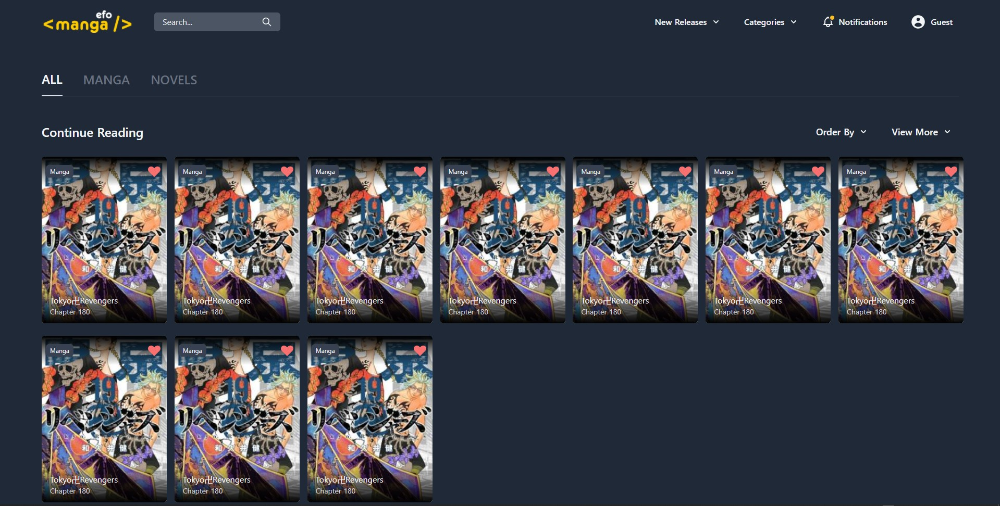

# Web Based Manga App

My First Commit Screnshot!


A web based manga reading app build with Nuxt JS.

Api : [API](https://github.com/febryardiansyah/manga-api)
UI Design : [UI](https://www.behance.net/gallery/105843153/Bastiat-Mangas-Website-Ui-Design)


## Build Setup

```bash
# install dependencies
$ yarn install

# serve with hot reload at localhost:3000
$ yarn dev

# build for production and launch server
$ yarn build
$ yarn start

# generate static project
$ yarn generate
```

For detailed explanation on how things work, check out [Nuxt.js docs](https://nuxtjs.org).
